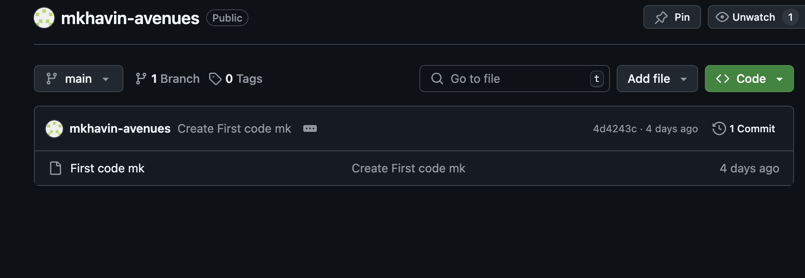

# commit_reflection.md

Yes as long as I make sure that I commit my changes I can track all my devlopment f my webiste throught my comits.
I feel that if a add a good description to each ome of my commits I can track effectively all the things I was doing. 
I can use notes or things like tracking my progress with reminders to keep my slef in check and help my self improve over all.
